# 星星守护者 — 特殊儿童陪伴系统

# 面向 ADHD（注意缺陷多动障碍）与自闭症谱系家庭的"边缘+云"陪伴方案
## 1. 支持3种模式：
### 家庭版-多动症，手机 App 为中枢；毛绒球向 App 实时传输心率/压力；毛绒球与手环数据同步与预警推送；家长侧记录后向星星设备推送 AI 建议，并启动星星机器人（xiaozhi）的 AI 聊天对话模式


### 2. 家庭版-孤独症，手机 App 为中枢；三种模式：主动发起，日常训练和计划表，由AI生成对应的图片，下发至星星机器人（xingxing）让孩子选择


### 3. 教师版，手机 App 为中枢；老师和孩子分别佩戴手环，当心率异常时，老师会收到报警，并注明对应的孩子


小米手环采集心率与压力，Flutter App 在父母手机端实时展示并触发陪伴流程，
ESP32-S3 LCD 毛绒球呼吸灯作为"正念呼吸+倒计时"的实体陪伴道具，
腾讯云 Flask 服务负责数据落盘、AI 单次建议、AI 周报，以及 App↔ESP32 的命令转发；
**星星机器人** 通过自建 WebSocket 语音云与长轮询远程唤醒（Path A，见 §5.4.1）——家长在手机端**提交行为记录（`POST /submit_log`）成功后，云端会立刻对孩子名下的星星设备入队 `xiaozhi_invoke_chat`，由星星主动开口陪伴孩子对话**，与 Kimi 给家长的文字建议并行完成；
父母吐槽的内容 push 到小红书发布。

---

## 目录

- [1. 系统总览](#1-系统总览)
- [2. 端到端关键流程](#2-端到端关键流程)
- [3. Flutter App](#3-flutter-app)
- [4. ESP32-S3 LCD 固件](#4-esp32-s3-lcd-固件)
- [5. 腾讯云 Flask 服务](#5-腾讯云-flask-服务)
- [6. 核心算法说明](#6-核心算法说明)
- [7. 数据模型 / 数据库 / API](#7-数据模型--数据库--api)
- [8. 部署与开发指引](#8-部署与开发指引)

---

## 1. 系统总览

### 1.1 三端 + 毛绒球 + 星星机器人

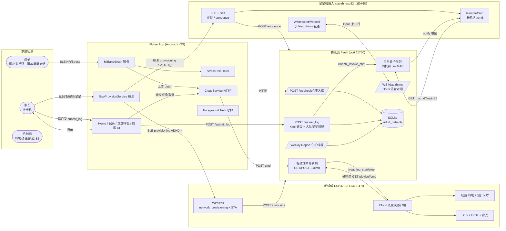

### 1.2 仓库结构

```text
ADHD_Monitor/
├── lib/                              # Flutter App 源码
│   ├── main.dart                     # FamilyShell：登录态切换 + child 选择
│   ├── models/                       # 数据模型
│   ├── screens/                      # 页面（home / login / 呼吸 / 配网 / 足迹 / 周报）
│   └── services/                     # 业务服务（MiBand / Stress / Cloud / ESP 配网 / FG 守护）
│
├── ESP32-S3-LCD-1.47B/               # ESP-IDF 工程（v6.0.x）
│   ├── main/
│   │   ├── main.c                    # 启动序列：黑屏待命，靠云端命令点亮
│   │   ├── Wireless/                 # WiFi + BLE provisioning + device_id
│   │   ├── Cloud/                    # 长轮询客户端
│   │   ├── RGB/                      # WS2812 呼吸灯 + 倒计时灯（默认 idle）
│   │   ├── LCD_Driver/               # ST7789 SPI + LEDC 背光
│   │   ├── LVGL_Driver/, LVGL_UI/    # LVGL 驱动 + Onboard 信息面板 + 琥珀全屏 overlay
│   │   ├── QMI8658/, BAT_Driver/     # IMU 与电池采样
│   │   ├── SD_Card/, I2C_Driver/     # SDMMC + 共享 I²C
│   │   └── Button_Driver/, Simulated_Gesture/  # BOOT 键 + 仿真触摸
│   ├── partitions.csv / sdkconfig    # 16 MB Flash, Octal PSRAM
│   └── idf_component.yml             # 含 network_provisioning / led_strip / lvgl 等
│
├── xiaozhi-esp32-2.2.4/              # 星星机器人固件（Path A：Bypass OTA + ADHD 长轮询 + /xiaozhi/ws）
│   └── main/                         # 含 adhd_remote_cmd.cc（CONFIG_ADHD_MONITOR_REMOTE_CMD）
│
└── server/
    ├── app.py                        # Flask 主程序（路由 + Kimi + 周报 + ESP32 长轮询 + Path A 注册）
    ├── xiaozhi_bridge.py             # Path A：/xiaozhi/ws（Kimi + edge-tts + 可选 Whisper，无 OTA）
    ├── requirements.txt              # Python 依赖（含 flask-sock / opuslib / edge-tts 等）
    ├── ecosystem.config.js           # PM2 进程描述（从仓库外 env 文件注入密钥，见 §8.1）
    ├── .env.example                  # 环境变量模板（不含真实密钥，可复制到 ~/.config/…）
    ├── .venv/                        # 建议的 Python venv（本地创建，已 .gitignore）
    └── adhd_data.db                  # SQLite 落盘（运行期生成，已 .gitignore，不入库）
```

### 1.3 默认网络拓扑

- App ↔ 云端：`http://<server>:11760`（默认 `124.223.53.33:11760`，存于 `SessionStore`）。
- ESP32 ↔ 云端：同 host:port，HTTP 长轮询 `/device/<device_id>/cmd?wait=25`。
- App ↔ ESP32：仅在**首次配网**时通过 BLE 直连（`network_provisioning` 协议，IDF 6.x 重命名自 `wifi_provisioning`）；配网完成后两端走云端中转，**不再依赖局域网可达**。
- 星星机器人 ↔ 云端：与毛绒球**同一 host:port**；HTTP 长轮询 `GET /device/<MAC>/cmd?wait=55` 收 `xiaozhi_invoke_chat`；语音会话走 **`ws(s)://<host>:11760/xiaozhi/ws`**（见 §5.4.1）。
- 手机 ↔ 小米手环：BLE GATT（FEE1 + 标准 180D HR 服务）。

---

## 2. 端到端关键流程

**家长提交行为记录（§2.4）** 是产品主链路之一：除 Kimi 给家长的短建议外，云端会**必走**对孩子绑定星星设备的 `xiaozhi_invoke_chat` 唤醒（详见 §5.4.1）。

### 2.1 ESP32 首次配网（一次性）

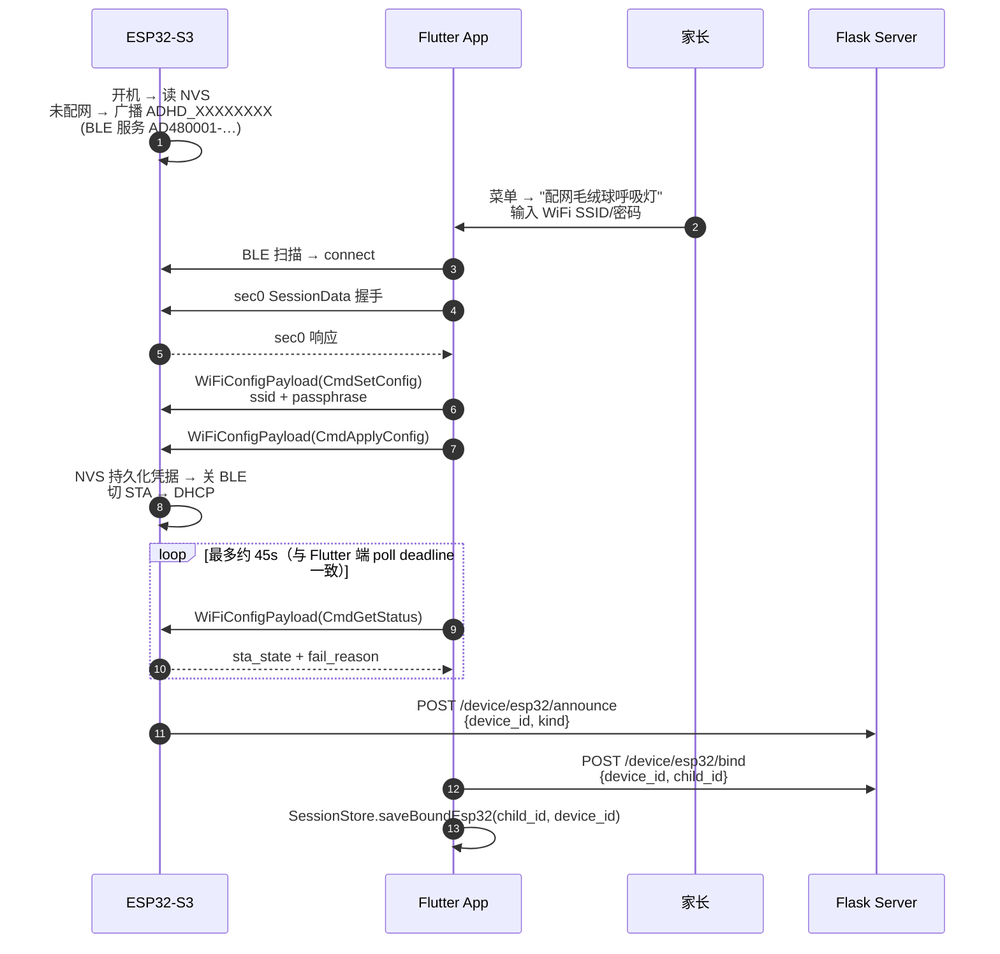

### 2.2 日常运行：手环→云端→App 心率回路

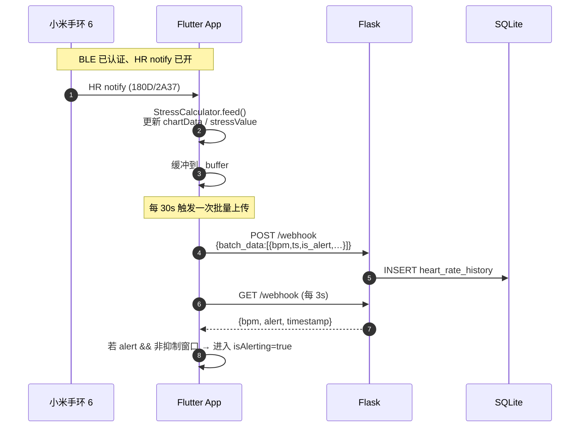

### 2.3 焦虑触发 → 正念呼吸 → ESP32 灯效

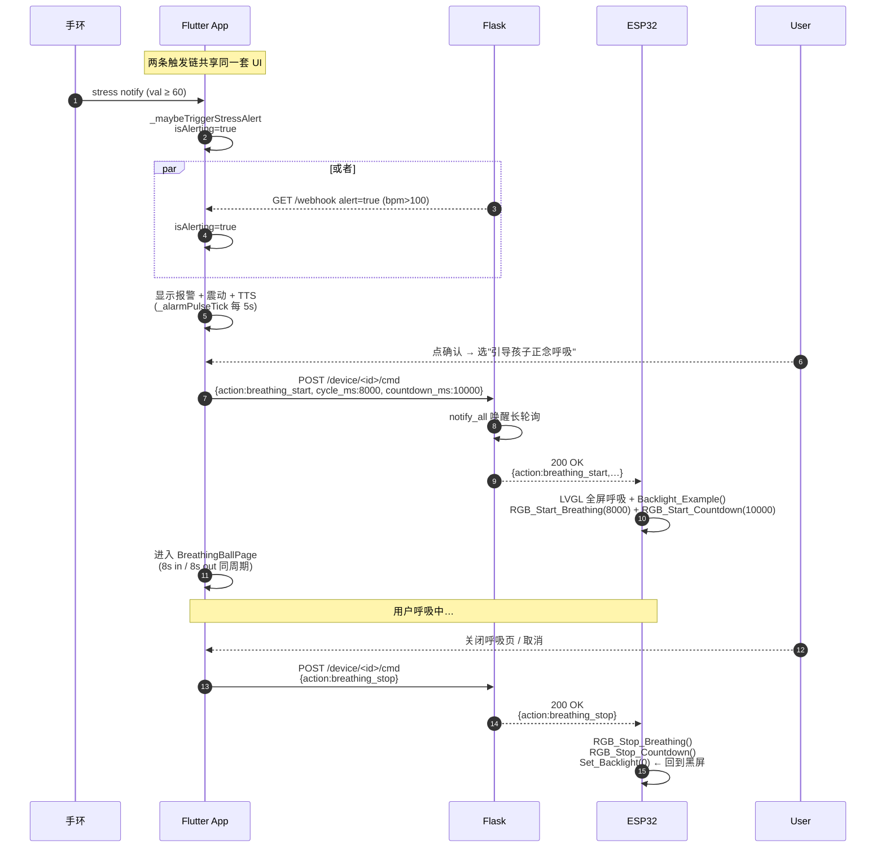

云端长轮询的延迟 < 100 ms（用 `threading.Condition` 唤醒 hold 住的连接）；
若 ESP32 离线或正在重连，命令会在内存队列里排队，板子重连后会一次性收完积压。

### 2.4 AI 单次建议 + 星星机器人对话（家长写记录）

家长提交记录后，产品闭环包含两条并行结果：**手机端展示 Kimi 给家长的短建议**，以及**星星机器人在孩子侧被唤醒并开始语音陪伴**（见 §5.4.1）。

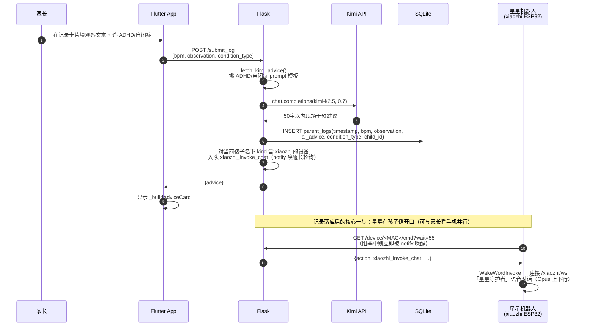

### 2.5 AI 周报（守护线程，周日 21:00）

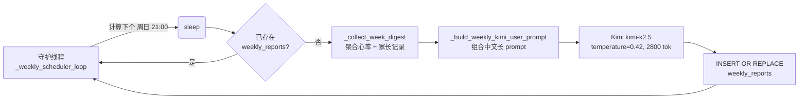

App 的 `WeeklyReportPage` 走 `GET /weekly_report/latest` 取最近一周的全文，404 当作"暂未生成"。
家长吐槽内容push至小红书。

---

## 3. Flutter App

### 3.1 顶层骨架

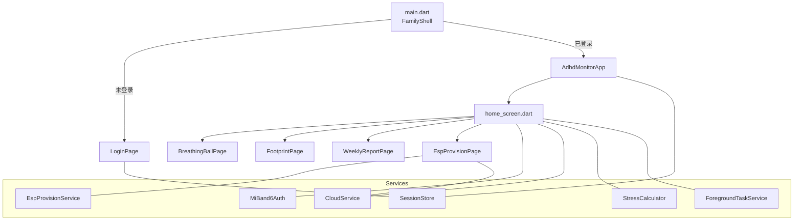

### 3.2 主要状态机

`_AdhdMonitorAppState`（home\_screen.dart）维护这些主线状态：

| 状态变量 | 含义 |
| --- | --- |
| `bpm` / `stressValue` | 实时心率 / 手环 0–100 压力值 |
| `isAlert` / `isAlerting` | 数据层是否报警（bpm≥120） / UI 是否处于报警态 |
| `isDismissed` | 家长是否已确认报警（进入"还在焦虑中"二选一界面） |
| `_flowInProgress` | 是否正在走完整一轮（确认→选择→记录/呼吸→Kimi） |
| `_breathingPageVisible` | 呼吸球全屏是否在前台 |
| `_healingPlaybackActive` | 432/528 Hz 疗愈音是否在播放 |
| `_massageStrokeOn` | 轻抚震动是否在循环 |
| `_rearmSuppressedUntil` | 报警消除后的抑制窗口（默认 45 s 或观察到一次 alert=false 即解除） |
| `_stressAlertThreshold` / `_stressAlertTriggered` | 顶栏菜单可滑动 stress 阈值 / stress 阈值触发去抖标志 |
| `_boundEsp32DeviceId` | 当前 child 绑定的 ESP32 device\_id（从 SessionStore 恢复） |

### 3.3 触发条件（"还在焦虑中"）

两条独立触发链共用同一组 UI：

1. **服务器 bpm 通道**：`fetchStatus()` 每 3 s 拉 `GET /webhook`，`alert=true` 触发。
2. **手环 stress 通道**：`_maybeTriggerStressAlert(stress)`，阈值 `_stressAlertThreshold` 默认 60，可在顶栏菜单 Slider 调整（30-90）：
   - 阈值按孩子保存到 `SessionStore`，下次打开 App 会恢复；
   - `stress < 阈值-5` 才允许下次触发，避免抖动；
   - 处于 `_flowInProgress` / 抑制窗口时跳过。

### 3.4 关键服务

#### MiBand6Auth — 小米手环 6 BLE 通道

- **认证**：FEE1 + 短 UUID `0000_0009_…` 上做 Huami 3-step AES-128-ECB 握手
  （`[0x01, 0x08, key]` → 收 nonce → 加密回传 `[0x03, 0x08, encrypted]`）。
- **HR notify**：标准 BLE SIG `180D/2A37`，按 flag bit 0 区分 8/16-bit BPM。
- **Stress 通道**：先按"调用方注入 UUID → FEE1 base 候选 → 短 ID 候选"顺序探测，
  失败则 `_autoDiscoverStressChar` 读全部 readable char，匹配能解析为 0–100 的格式；
  锁定后每 5 s 轮询 + 优先 notify；连续 60 s 同值 → 重做发现。
- **重连**：监听 `connectionState`，断线指数退避 `[5,10,20,30,60]s`；首次 HR notify 复位计数。
- **上传**：本地缓冲 + `_uploadTimer`（30 s）批量调 `CloudService.uploadHeartRateBatch`，
  失败时把批次插回队首保持顺序。

#### EspProvisionService — BLE 配网客户端

- 用 `flutter_blue_plus` 扫名以 `ADHD_` 开头的设备，按 RSSI 排序。
- 手写最小 protobuf 编码，按 `network_provisioning`（IDF 6.x 改名前叫 `wifi_provisioning`，proto 文件兼容）字段号实现：
  - SessionData(sec0) 握手；
  - WiFiConfigPayload(`CmdSetConfig{ssid, passphrase}`)；
  - WiFiConfigPayload(`CmdApplyConfig{}`）；
  - 轮询 `CmdGetStatus` 取 `sta_state`（0=Connected, 3=ConnectionFailed）。
- 服务/特征 UUID 与 ESP32 端 `wifi_prov_scheme_ble_set_service_uuid` 设置的固定值对齐：
  - 服务 `AD480001-7F86-46AD-A02E-3CA5849DA5B6`
  - `prov-session` `AD48FF51-…`，`prov-config` `AD48FF52-…`，`proto-ver` `AD48FF53-…`

#### CloudService — 唯一 HTTP 客户端

封装到云端的全部调用：心率上传、手环绑定、ESP32 绑定 / 命令、`Bearer + X-Child-Id` 注入。
"触发呼吸"用的两个方法：

```dart
cloudService.triggerEsp32BreathingStart(deviceId, cyclePeriod: 8s);
cloudService.triggerEsp32BreathingStop(deviceId);
```

#### StressCalculator — 离线压力降级算法

详见 §6.1。当手环 stress 通道暂时拿不到值时，App 仍能基于 HR 算出 0–100 估计值用于显示。

#### ForegroundTaskService — Android 守护

注册 `flutter_foreground_task` 低优先级常驻通知 `adhd_band_keepalive`，
锁屏/息屏期间避免 BLE 主 Isolate 被回收；iOS / 桌面是 no-op。

### 3.5 陪伴调节模式

正念呼吸全屏 / 疗愈音 / 轻抚震动任一开启，进入 `_inCompanionRegulationMode()`：
此时 `_alarmPulseTick`（5 s 一次的报警震动+TTS）会自动跳过，避免和陪伴节奏打架。

---

## 4. ESP32-S3 LCD 固件

### 4.1 启动序列

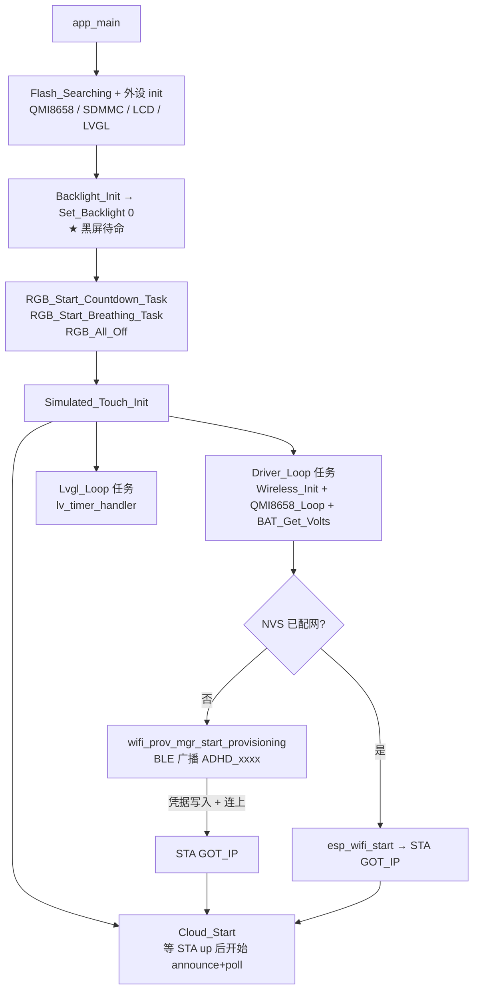

### 4.2 任务与核心绑定

| 任务 | 核心 | 优先级 | 栈 | 作用 |
| --- | --- | --- | --- | --- |
| `Driver task` | 0 | 3 | 4 KB | Wireless 初始化 + IMU + 电池 |
| `WIFI task` | 0 | 1 | 8 KB | wifi\_provisioning + 等 STA up |
| `cloud_poll` | 0 | 4 | 6 KB | HTTP 长轮询 + 解析命令 + 派发 |
| `rgb_breath` | 0 | 2 | 2 KB | 默认 idle，enable 后呼吸 |
| `rgb_countdown` | 0 | 4 | 3 KB | 默认 idle，enable 后倒计时 |
| `LVGL task` | 1 | 2 | 8 KB | LVGL 渲染/触摸主循环 |
| `backlight_breath` | 1 | 10 | 2 KB | LEDC 硬件 fade 呼吸（与 `Set_Backlight` 互斥） |
| `TouchTask` | 1 | – | – | BOOT 键 → 仿真触摸事件 |

### 4.3 Wireless：配网 + STA

- **device\_id** = efuse Wi-Fi MAC 后 4 字节的 8 位 Hex（如 `A1B2C3D4`），作为 BLE 广播名 `ADHD_A1B2C3D4` 和云端 device 主键。
- **第一次开机**：`network_prov_mgr_is_wifi_provisioned() == false` → 起 BLE provisioning（**security 0**，无 PoP，自定义 service UUID）；
  收到 `NETWORK_PROV_WIFI_CRED_RECV` → Manager 自动写 NVS、连 WiFi、emit `NETWORK_PROV_END` → `network_prov_mgr_deinit` 自动释放 BTDM。
  - **IDF 6.x 注意**：`CONFIG_ESP_PROTOCOMM_SUPPORT_SECURITY_VERSION_0` 默认关闭（IDF 推荐 sec2）。
    本项目 Flutter 客户端只手写实现了 sec0，所以 sdkconfig 里**显式 enable** 了 sec0；
    sec2 留着作为编译产物兼容，但不使用。日后如果想升级到 sec2，需要在 Flutter 端实现 SRP6a + PoP 握手。
  释放后整个 BLE 控制器都关掉了，**板子不再广播、手机也再扫不到 `ADHD_xxxxxxxx`**；
  之后 App 与板子全部走云端中转，手机端无需保留任何到板子的 BLE 连接。
- **二次开机**：Manager 检测到 NVS 已存凭据 → `wifi_prov_mgr_deinit` → 直接 `esp_wifi_start`，**完全不开 BLE**。
- **Captive Portal 探测**：连上后跑一次 `http://connectivitycheck.gstatic.com/generate_204`，
  不是 204 就把 `WIFI_Sta_CaptivePortal=true` 抛出来给 UI 使用。
- **断线重连策略**（家用路由器重启 / WiFi 长断时不掉队）：
  - 前 8 次 `WIFI_EVENT_STA_DISCONNECTED` → 立即 `esp_wifi_connect()` 快速重连；
  - 仍连不上 → 进入指数退避：30s → 60s → 120s → 240s → 480s（cap），用 `esp_timer_start_once`
    一次性触发 `esp_wifi_connect()`，每次失败后退避档位 +1；
  - 一旦 `IP_EVENT_STA_GOT_IP` 触发，定时器取消、retry 与退避档位双双清零。
  - 这样即使家里路由器拔了一晚上，第二天恢复后板子也能在 ≤ 8 分钟内自动重新上线。
- **重新配网**（换 WiFi / 换孩子 / 路由器换密码）有两条等价路径，最终都会调
  `Wireless_ResetProvisioning()` → `wifi_prov_mgr_reset_provisioning` + `esp_restart`，下次开机回到配网态：
  - **远程路径（推荐）**：App 在主页菜单点「让毛绒球呼吸灯重新配网」→ `triggerEsp32ResetProvisioning(deviceId)`
    → 服务器把 `{"action":"reset_provisioning"}` 推进 cmd 队列
    → `cloud_poll` 任务在 `Cloud.c::dispatch_cmd` 里命中分支，关屏关灯后调
    `Wireless_ResetProvisioning()`。
  - **物理路径（兜底）**：板子离线时，长按 BOOT 键 ≥ 5 秒。
    `Button_Driver` 在 `LONG_PRESS_START` 记录时间戳，`LONG_PRESS_HOLD` 每 5 ms 检查一次累计时长，
    超过 5 s 时主动调 `Wireless_ResetProvisioning()`；中途松手会清零，避免误触。
  - **`Wireless_ResetProvisioning()` 三层兜底**：
    1) 先调 `wifi_prov_mgr_reset_provisioning()`；
    2) 失败（manager 已 deinit 等）→ 调 `esp_wifi_restore()`；
    3) 再失败 → 直接 `nvs_open("nvs.net80211")` + `nvs_erase_all` 把 WiFi 命名空间擦干净。
       任一路径成功后 `esp_restart()`，确保下次开机一定回到 BLE 配网态。
  - 由于 `device_id` 来自 efuse MAC，**不会变**；服务器端的 `child_id ↔ device_id` 绑定关系也**会保留**，
    新一轮 BLE 配网完成后板子重新 announce 即立刻上线，无需 App 端再次走"绑定到孩子"流程。
  - **服务器端配合**：每次 `POST /device/esp32/announce` 都会清空该 device 的 cmd 队列，
    避免"用户重新配网完后毛绒球呼吸灯莫名其妙开始呼吸"这种残留命令重放问题；
    `POST /device/<id>/cmd action=reset_provisioning` 在入队时也会先 `clear()` 旧命令，
    保证 reset 是该轮 long-poll 的唯一动作。

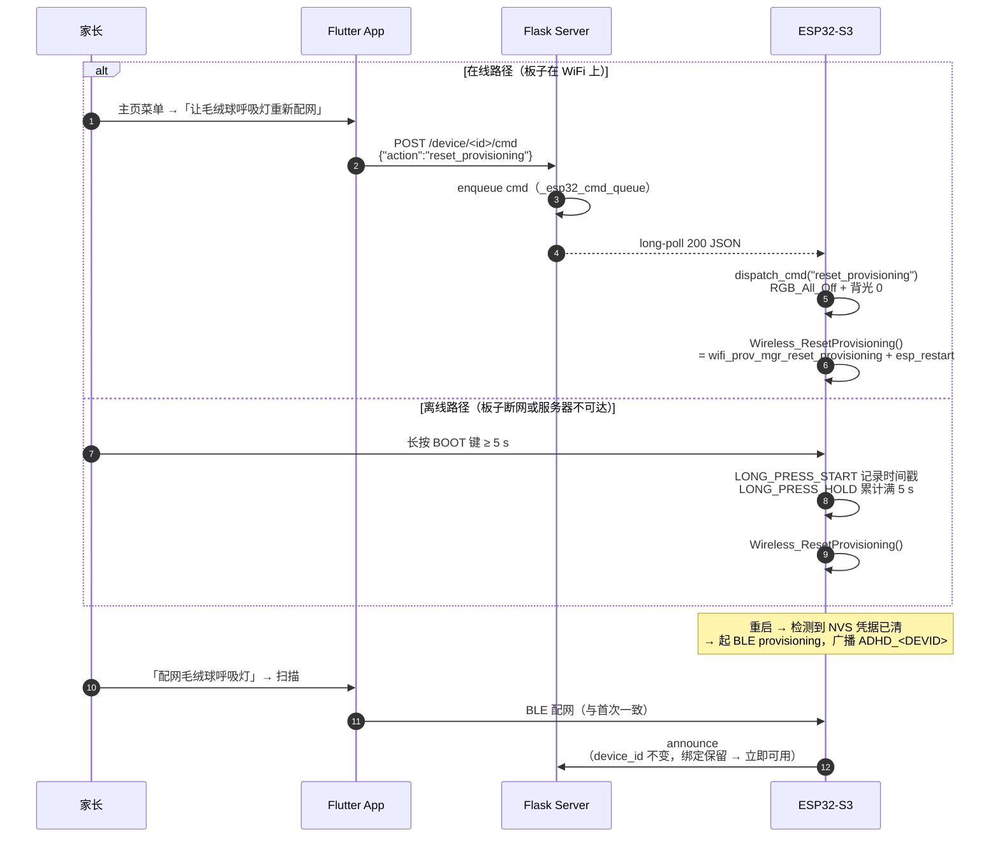

### 4.4 Cloud：长轮询客户端

```text
URL : GET http://{HOST}:{PORT}/device/{device_id}/cmd?wait=25
timeout = (wait + 5)s = 30s
```

服务器 200 → 解析 JSON → 派发到 RGB / LCD；
204 → 立刻下一轮；
其它状态 → 退避 2 s。
启动时 POST `/device/esp32/announce` 让云端登记新设备。

支持的 action 白名单（与服务器 `_ESP32_ALLOWED_ACTIONS` 一致）：

| action | 字段 | 行为 |
| --- | --- | --- |
| `breathing_start` | `cycle_ms`（1200–30000）<br/>`countdown_ms`（可选，默认 10000）<br/>`ttl_ms`（可选，默认 600000） | 启动 LVGL 全屏呼吸场景 + `Backlight_Example()` + `RGB_Start_Breathing(cycle_ms)` + `RGB_Start_Countdown(countdown_ms)` + arm watchdog |
| `breathing_stop` | — | `RGB_Stop_Breathing` + `RGB_Stop_Countdown` + 关闭 LVGL 场景 + `Set_Backlight(0)` + cancel watchdog |
| `countdown_start` | `total_ms`（1000–600000） | 启动 LVGL 全屏呼吸场景 + `Backlight_Example()` + `RGB_Start_Countdown(total_ms)` |
| `countdown_stop` | — | `RGB_Stop_Countdown` |
| `all_off` | — | `RGB_All_Off` + 关闭 LVGL 场景 + `Set_Backlight(0)` + cancel watchdog |
| `reset_provisioning` | — | 关屏关灯 + cancel watchdog 后 `Wireless_ResetProvisioning()` → 清 NVS + `esp_restart` |

**呼吸 watchdog**：`breathing_start` 会用 `esp_timer_start_once` 启动一个一次性兜底定时器（默认 10 分钟，
可通过 `ttl_ms` 字段覆盖）。如果 App 进程被杀 / 手机离线导致 `breathing_stop` 命令永远到不了，
板子也不会一直亮着——定时器到期会自动 `RGB_All_Off + 关闭 LVGL 场景 + Set_Backlight(0)`。`breathing_stop` /
`all_off` / `reset_provisioning` 都会取消这个定时器。

云端也支持 `{"cmds":[…]}` 数组形式批量下发，板子按顺序执行。

### 4.5 RGB 灯效

WS2812 单点（GPIO38），整灯 G 通道整体衰减 70%（实物绿芯偏亮）。两个独立 FreeRTOS 任务 + `atomic_bool` 开关：

- **呼吸（calm blue）**：周期由 `cycle_ms` 决定（默认 8 s），triangular wave 在 `scale ∈ [70, 255]` 范围调亮度；`s_countdown_led_active=true` 时自动让位。
- **倒计时（10 s 默认）**：按 4 : 3 : 3 比例分段：宁静蓝 → 琥珀橙 → 淡珊瑚粉，结束薄荷绿闪一次 → 黑 → 等 1 s → 下一轮。

### 4.6 LCD / LVGL

- **ST7789T 172×320 SPI**，DMA 双缓冲（每 buf = `H_RES * 20`）。
- **背光**：LEDC 13-bit @ 4 kHz；两条互斥路径：
  - `Backlight_Example()` → `backlight_breath` 任务，硬件 fade 上下呼吸 ~7 s 一周期；
  - `Set_Backlight(0–100)` → 关掉呼吸效果，直接设 duty。
- **黑屏待命**：`app_main` 里调 `Set_Backlight(0)`，LVGL 渲染循环保持运行但不创建可见场景；云端收到 `breathing_start` 后才创建全屏琥珀呼吸 overlay。
- **琥珀色全屏 overlay**：动画进行中把 disp refr timer 调到 50 ms（20 fps）省 CPU，结束恢复 30 ms。

### 4.7 依赖

```yaml
# main/idf_component.yml
dependencies:
  idf: ">=4.4"
  lvgl/lvgl: "~8.3.0"
  espressif/led_strip: "^2.4.1"
  espressif/network_provisioning: "^1.2.1"   # IDF 6.x 改名（原 wifi_provisioning），managed component
```

`main/CMakeLists.txt::REQUIRES` 至少要包含：
`esp_http_client esp_netif esp_wifi esp_event nvs_flash bt cjson esp_timer esp_lcd esp_driver_ledc fatfs spi_flash esp_adc sdmmc driver`。
（IDF 6.x 把 `json` 改名为 `cjson`，`network_provisioning` 内部依赖 `protocomm` 不需要再显式声明。）

`sdkconfig.defaults` 关键项：

```text
CONFIG_SPIRAM=y
CONFIG_SPIRAM_MODE_OCT=y
CONFIG_SPIRAM_SPEED_80M=y
CONFIG_ESPTOOLPY_FLASHSIZE_16MB=y
CONFIG_PARTITION_TABLE_CUSTOM=y
CONFIG_LV_USE_USER_DATA=y / CHART / PERF_MONITOR
```

`Kconfig.projbuild` 新增 `ADHD Cloud` 子菜单（host / port / wait\_s），便于不刷码改服务器地址。

---

## 5. 腾讯云 Flask 服务

### 5.1 进程结构

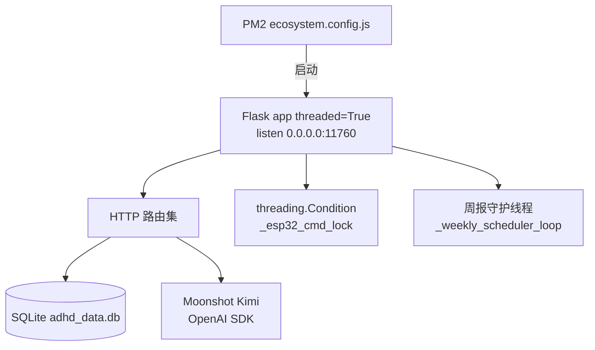

`threaded=True` 让每个 HTTP 请求一个线程处理，否则 ESP32 的长轮询会阻塞整服务。

### 5.2 路由分组

| 分组 | 路由 |
| --- | --- |
| **认证 / 家庭** | `POST /auth/register`, `POST /auth/login`, `GET\|POST /my/children`, `POST /my/children/<id>/members`, `GET /my/config/xiaomi-band-auth-key`（手环 BLE 密钥，Bearer） |
| **心率 / 状态** | `POST\|GET /webhook`, `GET /history` |
| **AI 单次建议** | `POST /submit_log`（写记录 + 调 Kimi + **对孩子名下星星设备入队 `xiaozhi_invoke_chat`**） |
| **AI 足迹 / 周报** | `GET /footprint/today`, `GET /weekly_report/latest`, `GET /weekly_report/history`, `POST /weekly_report/generate` |
| **手环绑定** | `GET /device/<mac>/binding`, `POST /device/bind`, `POST /device/unbind` |
| **ESP32（毛绒球 + 星星）** | `POST /device/esp32/announce`, `GET /device/esp32/list`, `POST /device/esp32/bind`, `POST /device/esp32/unbind`, `GET\|POST /device/<device_id>/cmd`（长轮询 + 白名单；星星走同一 `cmd` + `WS /xiaozhi/ws`） |

### 5.3 鉴权 & 权限

- **密码**：PBKDF2-HMAC-SHA256，**120 000 iter**，16 字节 salt，存储 `"salt$hexhash"`；校验 `hmac.compare_digest`。
- **Session**：登录返回随机 token (`secrets.token_urlsafe(32)`)，TTL 14 天，写 `sessions` 表。
- **每请求**：
  - `_get_request_user()` 读 `Authorization: Bearer …` → 查 sessions。
  - `_resolve_child_id_for_read()`：未登录仅允许 `child_id=1`；已登录必须在 `child_members` 表里。
  - `_resolve_child_id_for_write()`：硬件 / 模拟器允许匿名写（要求 `child_id` 已存在）；其它走成员校验。
- **CORS**：`CORS(app)` 全开（适合移动客户端 + Bearer token；如开放浏览器端需收紧）。

### 5.4 ESP32 长轮询命令通道

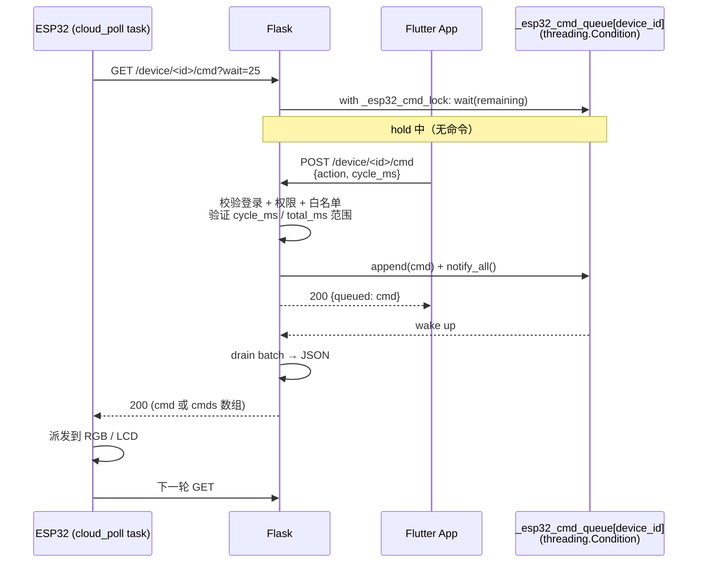

- 单条命令时返回 `{action, …}`；多条时返回 `{cmds: [...]}`。
- ESP32 端 `Cloud.c` 两种都能解析。
- hold 上限 60 s，下限 0 s；ESP32 客户端默认 25 s。

### 5.4.1 星星机器人（xiaozhi-esp32）— 记录后的语音陪伴核心（自建语音云，调用百度智能短语音和Edge TTS来完成语音和文字的转换）

本仓库内 `xiaozhi-esp32-2.2.4` 与 **同一套 Flask** 对接，替代官方小智云，构成「家长写完观察 → 孩子侧立刻有星星开口」的**主路径**，不是可选增强。**整条链路不依赖任何 OTA / 激活服务器**：固件在 `menuconfig` 中直接配置 WebSocket URL，启动时把它写进 `websocket` NVS 命名空间，然后跳过 `CheckAssetsVersion` / `CheckNewVersion` 全流程，直接用 `WebsocketProtocol` 连上服务器的 **`/xiaozhi/ws`**。语音链路为 **上行 Opus → 百度短语音 ASR → Kimi → edge-tts → 下行 Opus**（不再依赖 OpenAI）。家长 **`POST /submit_log`** 成功后，服务器会对当前孩子名下、且 `esp32_devices.kind` 含 **`xiaozhi`** 的设备自动入队 **`xiaozhi_invoke_chat`**；固件侧 `adhd_remote_cmd` 任务长轮询 **`GET /device/<MAC>/cmd?wait=55`**，收到命令后调用 **`WakeWordInvoke`** 打开音频通道。

| 组件 | 说明 |
|------|------|
| `server/xiaozhi_bridge.py` | 仅暴露 **`/xiaozhi/ws`**（`flask-sock`），握手时校验 `Authorization: Bearer <XIAOZHI_WEBSOCKET_TOKEN>`（留空则不校验）|
| `server/app.py` | 扩展命令白名单 `xiaozhi_invoke_chat` / `xiaozhi_abort`；`device_id` 归一化去掉冒号；`submit_log` 后入队；绑定接口支持 **`kind`** |
| `xiaozhi-esp32-2.2.4/main/adhd_remote_cmd.cc` | 启动时 `seed_settings()` 把 Kconfig 的 URL/token 写入 NVS；之后做 `POST /device/esp32/announce` + 长轮询 |
| `xiaozhi-esp32-2.2.4/main/application.cc` | `CONFIG_ADHD_MONITOR_BYPASS_OTA` 打开后，`ActivationTask` 跳过 OTA 调用，`InitializeProtocol` 强制 `WebsocketProtocol` |
| Flutter | 顶栏菜单「**配网星星机器人** / **让星星机器人重新配网**」→ 与毛绒球同源的 `EspProvisionPage`（`kind: EspProvKind.xiaozhi`）；广播名前缀 `XIAOZHI_<MAC8>`，绑定时向云端打 `kind=xiaozhi` 标签。也保留「绑定小智设备 (MAC)」做手动 fallback |
| `xiaozhi-esp32-2.2.4/main/adhd_prov_ble.{h,cc}` | 当 `CONFIG_USE_ADHD_BLE_WIFI_PROVISIONING=y` 时启用：用 ESP-IDF `network_prov_mgr` + `scheme_ble`（security 0、服务 UUID `ad480001-…`）暴露与毛绒球**完全相同的 BLE 配网协议**，广播名 `XIAOZHI_<MAC8>`；NETWORK_PROV_END 后 `esp_restart()` 让 xiaozhi 自带的 `WifiManager` 在下次启动时读 NVS 接管 STA。`reset_provisioning` 命令通过 `adhd_remote_cmd.cc` 触发 |

**服务器依赖**（`server/requirements.txt`）：`flask-sock`、`opuslib`（需系统 **libopus**）、**`ffmpeg`** 在 `PATH` 中、`edge-tts`、`requests`；语音识别走 **百度短语音识别标准版**（[文档](https://cloud.baidu.com/doc/SPEECH/s/Jlbxdezuf)），需要在百度智能云控制台创建语音应用拿到 **`BAIDU_SPEECH_API_KEY`** / **`BAIDU_SPEECH_SECRET_KEY`**，写到 `~/.config/adhd-monitor.env`。可选 **`BAIDU_SPEECH_DEV_PID`**（默认 1537=普通话）、**`BAIDU_SPEECH_CUID`**（控制台调用源标识）。可设置 **`XIAOZHI_WEBSOCKET_TOKEN`** 强制设备携带匹配的 Bearer token；不设置则任何来源的 `/xiaozhi/ws` 都允许接入（仅用于内网/本地测试）。

**固件配置**：`idf.py menuconfig`：

1. **ADHD Monitor integration**：
   1. 打开 **`Long-poll ADHD Monitor /device/<mac>/cmd`**；
   2. 填写 **`ADHD_MONITOR_CMD_HOST`** / **`ADHD_MONITOR_CMD_PORT`**（命令通道 + announce + `reset_provisioning`）；
   3. 默认勾选的 **`Bypass xiaozhi OTA (seed websocket NVS from Kconfig)`** 保留打开；
   4. 填写 **`ADHD_MONITOR_WS_URL`**（例：`ws://124.223.53.33:11760/xiaozhi/ws`）与可选的 **`ADHD_MONITOR_WS_TOKEN`**（与服务器 `XIAOZHI_WEBSOCKET_TOKEN` 一致）。
2. **WiFi Configuration Method**：勾选 **`ADHD Monitor BLE (network_provisioning, sec0)`**。其余三项（Hotspot / Acoustic / Esp Blufi）保持关闭，否则 `WifiBoard::StartWifiConfigMode()` 会优先走那条路径。这一项打开后：
   - 出厂未配网时启动会广播 `XIAOZHI_<MAC8>`（与毛绒球的 `ADHD_<MAC8>` 同协议、同服务 UUID `ad480001-…`），App 在「配网星星机器人」页面扫到后即可写入 SSID/密码；
   - 配网成功 → `esp_restart()` → xiaozhi 自带的 `WifiManager` 用 NVS 中的凭据接管 STA → 长轮询 `/device/<MAC>/cmd` + 走 `/xiaozhi/ws`；
   - 「让星星机器人重新配网」下发 `reset_provisioning` 命令 → `adhd_prov_ble_reset_and_reboot()` 清掉 wifi NVS（包括 xiaozhi `SsidManager` 用的 `wifi` 命名空间）→ 重启重新进入 BLE 配网。

烧录后——设备每次启动都用 Kconfig 中的值覆盖 NVS `websocket` 命名空间，并直接走 WebSocket 协议。

**对话行为与省电 / 容错**：

- 主动开场身份：家长提交行为记录后，星星机器人第一次主动对孩子说话时会先说 **「我是星星守护者。」**，后续普通追问轮不会重复自我介绍。
- 称呼规则：无论家长记录里写“他/她/孩子”，对孩子外放时都必须改写为 **「你」**，避免第三人称造成生硬感。
- 回复容错：`server/xiaozhi_bridge.py` 对百度 ASR、Kimi、edge-tts 分别加超时兜底。若外部服务卡住，会回复“我刚才没有听清楚…”或“我好像打了个盹…”这类兜底句，不让设备长时间无声。
- 休眠省电模式：固件收到明确停止类口令（如“停止”“结束对话”“别说了”“不聊了”“进入休眠省电模式”“睡觉吧”）会调用 `EnterSleepPowerSaveMode(...)`，关闭当前音频通道并切回 `PowerSaveLevel::LOW_POWER`，状态显示为“休眠省电中”。
- 1 分钟无语音自动休眠：星星机器人进入聆听后，如果 60 秒内没有检测到有效说话，也会自动终止本轮对话并进入休眠省电模式。
- 误判规避：普通语义里的“休息”（例如“怎么休息呢？拍皮球吗？”）不会再被当成停止对话；只有明确停止/休眠类口令才会触发休眠。

### 5.5 AI 单次建议 & 趋势对比

- `fetch_kimi_advice(bpm, observation, condition_type)` 按 ADHD / 自闭症 各自挑 system + user prompt 模板，默认 **`kimi-k2.5`**（可用 `MOONSHOT_CHAT_MODEL` 覆盖）+ `temperature=0.7`，并要求默认 `extra_body` 关闭思考（更快）。要求 50 字以内不带套话。Kimi 不可用时按 `condition_type` 返回硬编码兜底文案。
- `/footprint/today` 拉今天每条 `parent_logs`，并逐条调 `_trend_after_advice`：取**记录前 15 min** 与**记录后 20 min** 的心率均值差 `delta`，
  `delta ≤ -3 → improving`，`delta ≥ +3 → worsen`，否则 `steady`；样本不足为 `unknown`。

### 5.6 AI 周报

- `_weekly_scheduler_loop`：每周日 21:00 触发（若 `now.weekday()==6 && now<21:00` 用今天；否则下周日）；保底 30 s 间隔；`DISABLE_WEEKLY_SCHEDULER=1` 可关闭。
- `_collect_week_digest`：心率全表统计 + 按小时聚合 top-12 高压时段（`alert_rate DESC, avg_bpm DESC`）+ 按天聚合 + 最近 40 条 `parent_logs`。
- `_build_weekly_kimi_user_prompt`：固定 8 段 Markdown-free 中文 prompt，强制 350–700 字、2–4 段、第二人称、不带 JSON 标题。
- 默认 **`kimi-k2.5`**（`WEEKLY_REPORT_MODEL` 可覆盖）+ `temperature=0.42`，`max_tokens=2800`，同样默认关闭思考；返回 < 40 字符直接 `RuntimeError` 不入库。

> 当前实现 hard-code `child_id=1`，多孩子家庭的周报需要手动 `POST /weekly_report/generate` 指定 `child_id`。

---

## 6. 核心算法说明

### 6.1 StressCalculator：HR → 0-100 压力估计

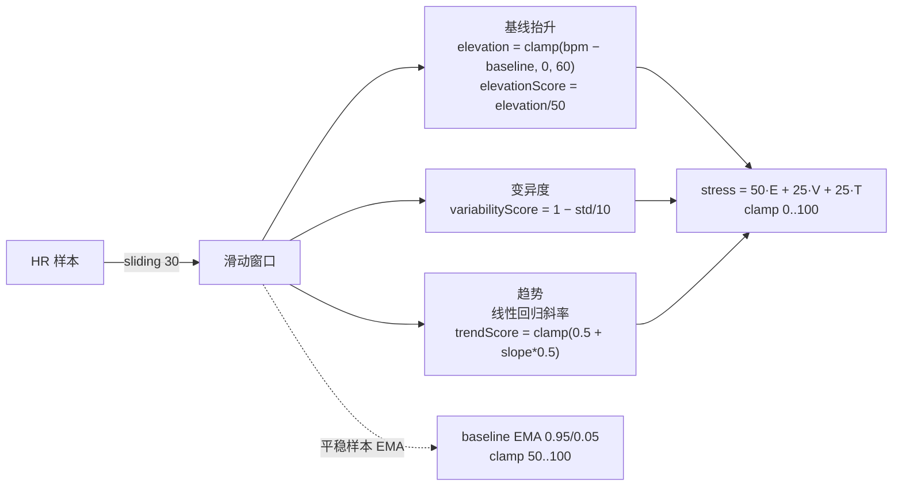

要点：
- 需 ≥ 5 个样本，否则返回 `null`。
- baseline 只在 `bpm < baseline+5` 时更新，**避免飙升把基线带高**。
- 维度权重：基线抬升 50%、变异度 25%、趋势 25%。
- 与手环私有 stress notify 互为补充：notify 拿不到值时用这个降级显示。
- 顶栏菜单"设置压力报警阈值"提供 Slider 调整报警阈值（30-90，默认 60），并展示算法摘要。

### 6.2 Mi Band 6 认证（AES-128-ECB）

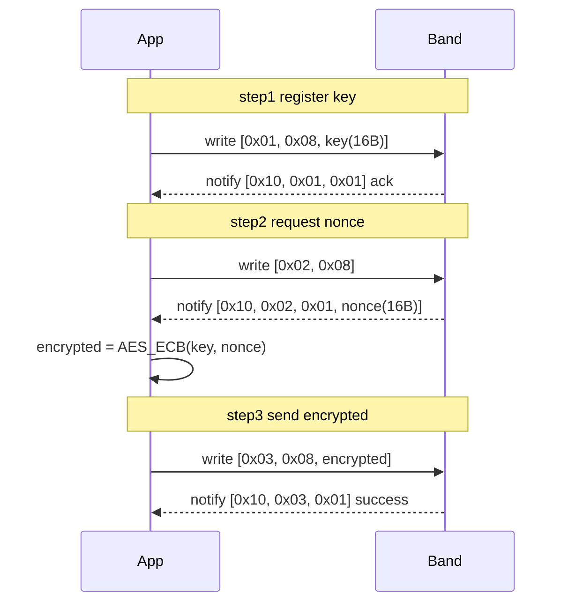

Auth Key 是 32 位 hex（用户从 Mi Fit / Zepp Life / Gadgetbridge 等取得）。**推荐**在服务器 `~/.config/adhd-monitor.env` 中配置 `XIAOMI_AUTH_KEY`（见 `server/.env.example`），由 `GET /my/config/xiaomi-band-auth-key`（须登录）下发给 App；家长端在自动连接手环前会拉取并写入 `MiBand6Auth.authHexKey`。勿把密钥提交到 Git。

### 6.3 ESP32 BLE 配网协议（自实现 protocomm）

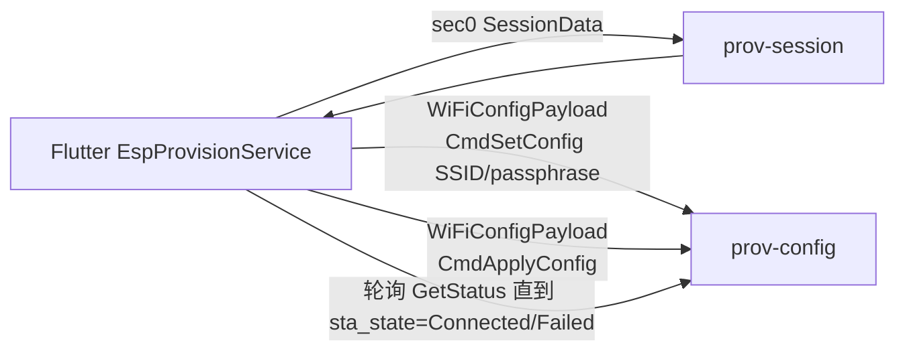

字段号严格按 ESP-IDF `wifi_provisioning/proto/*.proto`：

```text
SessionData       { sec_ver=2, sec0=10 }
Sec0Payload       { msg=1, sc=20, sr=21 }
WiFiConfigPayload { msg=1, cmd_get_status=10, resp_get_status=11,
                    cmd_set_config=12, resp_set_config=13,
                    cmd_apply_config=14, resp_apply_config=15 }
CmdSetConfig      { ssid=1 bytes, passphrase=2 bytes, bssid=3 bytes, channel=4 int32 }
RespGetStatus     { status=1, sta_state=2, fail_reason=10, connected=11 }
```

Dart 端只实现 varint + length-delimited 两种 wire-type 的最小编/解码器，
**完全兼容 Espressif 官方 ESP BLE Provisioning App**——固件那侧用的是官方
`network_provisioning_manager`（IDF 6.x 重命名前为 `wifi_provisioning_manager`，proto 协议不变），
只是我们绕过了上层移动 SDK，省掉 protobuf-dart 这种重依赖。

### 6.4 长轮询命令通道（< 100 ms 唤醒）

服务器端核心实现（精简伪代码）：

```python
with _esp32_cmd_lock:
    while True:
        q = _esp32_cmd_queue.get(device_id)
        if q:                          # 有命令：立刻全部 drain 返回
            batch = list(q); q.clear()
            return jsonify(batch[0] if len(batch)==1 else {"cmds": batch})
        remaining = deadline - now()
        if remaining <= 0:             # 超时：返回 204，ESP32 立刻再来一轮
            return Response(status=204)
        _esp32_cmd_lock.wait(remaining)
```

App 端推命令时：

```python
with _esp32_cmd_lock:
    q = _esp32_cmd_queue.setdefault(device_id, deque())
    q.append(cmd_obj)
    _esp32_cmd_lock.notify_all()        # 立即唤醒 hold 中的连接
```

### 6.5 报警去抖 / 重武装窗口

`_rearmSuppressedUntil` 在用户手动消除报警时被设为 `now + 45s`。
之后只要满足"已过 45 s" **或** "至少看到一次服务器 `alert=false`" 之一，就允许下一次新报警进入。
这避免了硬编码 2 分钟死等错过后续真实升高、也避免了 alert flag 抖动反复弹出。

stress 通道独立去抖：`stress < 阈值-5` 才允许 `_stressAlertTriggered` 复位；阈值由顶栏菜单 Slider 调整并按孩子本地保存。

---

## 7. 数据模型 / 数据库 / API

### 7.1 SQLite Schema

```text
users(id, username UNIQUE (lowercase), password_hash, display_name, created_at)
sessions(id, token UNIQUE, user_id, expires_at)
children(id, nickname, created_at, created_by_user_id)
child_members(id, user_id, child_id, role, created_at, UNIQUE(user_id, child_id))

heart_rate_history(id, timestamp, bpm, is_alert, child_id DEFAULT 1)
parent_logs(id, timestamp, bpm, observation, ai_advice, condition_type, child_id DEFAULT 1)
weekly_reports(id, week_start, week_end, summary, digest_json,
               created_at, child_id DEFAULT 1, UNIQUE(week_start, child_id))

device_bindings(id, mac_address UNIQUE, child_id, bound_by_user_id, created_at)  -- 手环
esp32_devices(id, device_id UNIQUE, kind, child_id NULL, bound_by_user_id NULL,
              first_seen_at, last_seen_at)                                       -- 毛绒球呼吸灯
```

启动时 `init_db()` 会自动做"老库补列 + 老 `weekly_reports` 迁移到 (week\_start, child\_id) UNIQUE"。

### 7.2 数据模型（Flutter）

```text
HeartRateSample { int bpm; DateTime timestamp; bool isAlert }
BandStressSample { int value (0-100); DateTime timestamp }
DeviceBinding { String macAddress; int? boundChildId; String? nickname; bool isBoundToCurrentChild }
```

### 7.3 服务端 API 速查

| 方法 | 路径 | 鉴权 | 说明 |
| --- | --- | --- | --- |
| POST | `/auth/register` | 否 | `{username, password, display_name?}` |
| POST | `/auth/login` | 否 | 返回 `{token, user}` |
| GET | `/my/children` | 是 | 列出我能访问的孩子 |
| POST | `/my/children` | 是 | 创建孩子（自动加 guardian） |
| POST | `/my/children/<id>/members` | 是 | 邀请别的注册用户加入孩子 |
| GET | `/webhook` | child=1 可匿名 | 返回最新 `{bpm, alert, timestamp}` |
| POST | `/webhook` | 见 §5.3 | 写心率（手环 / 模拟器 / App 都用这个） |
| GET | `/history` | 同上 | 最近 20 条 |
| POST | `/submit_log` | 同上 | 写记录 + Kimi 建议 + **星星 `xiaozhi_invoke_chat` 入队** |
| GET | `/footprint/today` | 同上 | 今日记录 + 趋势 |
| GET | `/weekly_report/latest` | 同上 | 最近周报 |
| GET | `/weekly_report/history` | 同上 | 历史列表 |
| POST | `/weekly_report/generate` | 选填 `WEEKLY_REPORT_SECRET` | 手动触发 |
| GET | `/device/<mac>/binding` | 选 | 查手环绑定 |
| POST | `/device/bind` / `unbind` | 是 | 手环绑/解 |
| POST | `/device/esp32/announce` | 否 | ESP32 上电自报 |
| GET | `/device/esp32/list` | 是 | 列我可见的 ESP32（毛绒球 / 星星，未绑 + 已绑给我家） |
| POST | `/device/esp32/bind` / `unbind` | 是 | ESP32 绑/解（`kind` 区分毛绒球与 xiaozhi） |
| GET | `/device/<device_id>/cmd?wait=N` | 否 | ESP32 长轮询拉指令（毛绒球 + 星星） |
| POST | `/device/<device_id>/cmd` | 是 | App 推指令（action 白名单 + 范围校验） |
| WS | `/xiaozhi/ws` | 可选 Bearer（`XIAOZHI_WEBSOCKET_TOKEN`） | 星星语音上下行（Opus），见 §5.4.1 |

`X-Child-Id` header 用于读写所有"按孩子"的数据；未带时默认 `1`。

---

## 8. 部署与开发指引

### 8.1 服务器

1. **Python 3.10+**，在 `server/` 下建 venv（仓库已忽略 `server/.venv/`，勿提交）：
   ```bash
   cd server
   python3 -m venv .venv
   source .venv/bin/activate   # Windows: .venv\Scripts\activate
   pip install flask flask-cors openai
   ```
   无顶层 `requirements.txt`，以上依赖与 `app.py` import 一致即可。

2. **密钥与配置**  
   - 复制模板：`cp server/.env.example ~/.config/adhd-monitor.env`  
   - 编辑 `~/.config/adhd-monitor.env`，填入真实 `MOONSHOT_API_KEY` 等；`chmod 600 ~/.config/adhd-monitor.env`。  
   - `server/ecosystem.config.js` 会读取该文件并注入到 PM2 子进程；也可用环境变量 `ADHD_ENV_FILE` 指向其它路径。  

   可选环境变量（与 `app.py` 一致）：
   - `MOONSHOT_API_KEY`（必填，Kimi）
   - `MOONSHOT_BASE_URL`（默认 `https://api.moonshot.cn/v1`）
   - `MOONSHOT_CHAT_MODEL`（默认 `kimi-k2.5`：家长建议 + 星星机器人脚本）
   - `WEEKLY_REPORT_MODEL`（默认 `kimi-k2.5`）
   - `MOONSHOT_ENABLE_THINKING=1`（可选；设置后不再自动附带 `thinking: disabled`）
   - `MOONSHOT_EXTRA_BODY_JSON`（可选；合法 JSON 对象，与默认 `thinking` 合并）
   - `XIAOZHI_CHAT_MODEL`（默认 `kimi-k2.5`；星星机器人 WebSocket Kimi 回复）
   - `XIAOZHI_ASR_TIMEOUT_S`（默认 5；ASR 整体超时，超时后走“没听清”兜底）
   - `XIAOZHI_ASR_HTTP_TIMEOUT_S`（默认 5；百度短语音 HTTP 请求超时）
   - `XIAOZHI_BAIDU_OAUTH_TIMEOUT_S`（默认 5；百度 OAuth token 请求超时）
   - `XIAOZHI_REPLY_TIMEOUT_S`（默认 5；Kimi 普通对话回复超时，超时后走“打盹了”兜底）
   - `XIAOZHI_KIMI_HTTP_TIMEOUT_S`（默认 5；Kimi SDK HTTP 请求超时）
   - `XIAOZHI_TTS_TIMEOUT_S`（默认 5；单段 edge-tts → opus 合成超时）
   - `WEEKLY_REPORT_SECRET`（可选；设置后 `/weekly_report/generate` 要带 `X-Weekly-Report-Secret`）
   - `DISABLE_WEEKLY_SCHEDULER=1` 可关周报守护线程
   - `CHILD_DISPLAY_NAME`（影响周报里的称呼）

3. **开发启动**（改代码后需重启进程，`debug=False` 不会热重载）：
   ```bash
   cd server && source .venv/bin/activate
   set -a && source ~/.config/adhd-monitor.env && set +a   # 载入 KEY=value 行；或手动 export
   python app.py
   ```

4. **生产：PM2**（与当前线上一致）：
   ```bash
   cd server
   pm2 startOrRestart ecosystem.config.js
   pm2 save
   ```
   开机自启（一次性）：`sudo env PATH=/usr/local/sbin:/usr/local/bin:/usr/sbin:/usr/bin:/sbin:/bin pm2 startup systemd -u $USER --hp $HOME`，按提示执行输出的 `sudo systemctl enable …`，再 `pm2 save`。  
   日志：`server/app.log`、`server/app.error.log`（由 `ecosystem.config.js` 指定）。

5. 默认监听 `0.0.0.0:11760`，请确保云安全组放行。

6. **Git 推送若遇 HTTP 408 / TLS 断连**（部分 Ubuntu 上 `git-remote-http` 链 GnuTLS）：可尝试 `git config --local http.version HTTP/1.1` 与较大 `http.postBuffer` 后重试。

### 8.2 ESP32 固件

1. ESP-IDF 6.0.x（本仓库使用 `C:\esp\v6.0.1\esp-idf`，路径自定）。
2. 工程根目录配置：
   ```powershell
   .\idf.ps1 set-target esp32s3
   .\idf.ps1 menuconfig
   #   Component config → ADHD Cloud → Cloud server host / port
   .\idf.ps1 build
   .\idf.ps1 -p COM4 flash monitor
   ```
   分区表见 `partitions.csv`：`factory = 6M`（含 LVGL + BLE provisioning + Cloud + WS2812 全功能镜像）。
   如果之前 build 报 `binary size has exceeded the limit`，拉新代码后先 `idf.py reconfigure` 让 IDF 重新读分区表。
   NVS 偏移仍是 0x9000，已配网的板子无需 `erase-flash` 就能升级。
3. **首次烧录后**：板子会广播 `ADHD_<MAC末4字节hex>`，用 App 的"配网毛绒球呼吸灯"完成 WiFi + 云端绑定；
   配网完成后板子自动 `wifi_prov_mgr_deinit` 关掉 BLE，**手机端不需要也无法再连这台板子的 BLE**。
4. **重新配网**：
   - 在线时：App 主页 →「让毛绒球呼吸灯重新配网」（菜单项），或配网页顶部"远程命令：让毛绒球呼吸灯重启进入 BLE"。
     云端会下发 `reset_provisioning` 命令，板子收到后清 NVS 并重启回到 BLE 广播态。
   - 离线时：长按板子 BOOT 键 ≥ 5 秒，板子会主动调 `Wireless_ResetProvisioning()` 清 NVS 并重启。

### 8.3 Flutter App

```bash
flutter pub get
flutter run    # 真机推荐，模拟器没有 BLE
```

### 8.4 已知限制 & 待办

- 目前只支持小米手环6，后续可能会添加更多的硬件。
- 目前只支持安卓APP，后续可能会开发IOS APP。
- ESP32硬件板子只支持微雪ESP32-S3-LCD和星智CUBE聊天机器人。
- 安卓系统不允许程序读取手机当前 WiFi 密码，配网页面**必须手动输入**密码。
- 周报守护线程目前硬编码 `child_id=1`；多孩子家庭需要手动 `POST /weekly_report/generate`。
- 家长吐槽内容生成不能自动push到小红书，目前小红书没有提供这样的接口。
