# 星星守护者 — 特殊儿童陪伴系统

面向 ADHD（注意缺陷多动障碍）与自闭症谱系家庭及学校的"边缘+云"陪伴方案，支持三种模式：

| 模式 | 核心场景 | 硬件 | 代码目录 |
|------|---------|------|---------|
| **家庭版-多动症** | 心率/压力监测 → 报警 → 正念呼吸 → AI 建议 + 星星语音陪伴 | 小米手环 + 毛绒球呼吸灯 + 星星机器人 | `lib/` · `ESP32-S3-LCD-1.47B/` · `xiaozhi-esp32-2.2.4/` · `server/` |
| **家庭版-孤独症** | 家长选训练场景 → AI 生成图片 → 星星展示 → 孩子图片交互 | 星星机器人 | `lib/` · `xingxing/` · `server/` |
| **教师版** | 多名学生手环同时监测 → 心率异常立即提醒老师并标注孩子名字 | 小米手环（老师+学生各戴） | `lib/` · `xiaozhi-esp32-2.2.4/` · `server/` |

### 家庭版-多动症
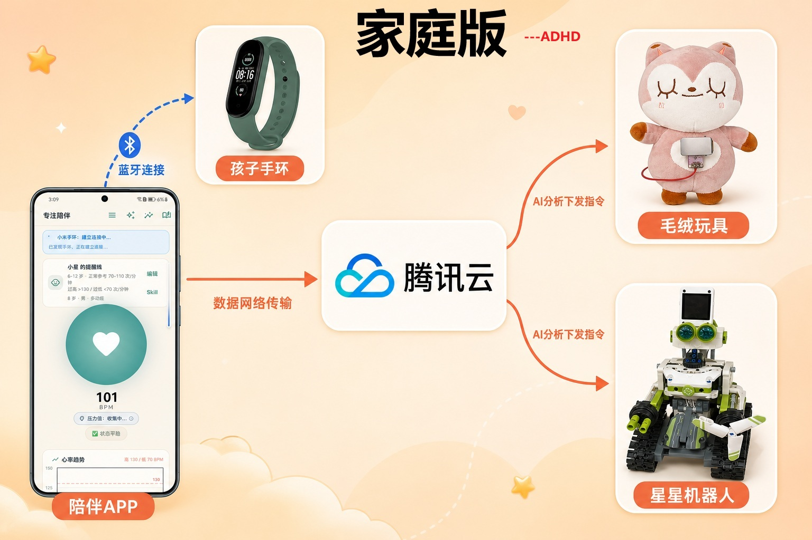

### 家庭版-孤独症
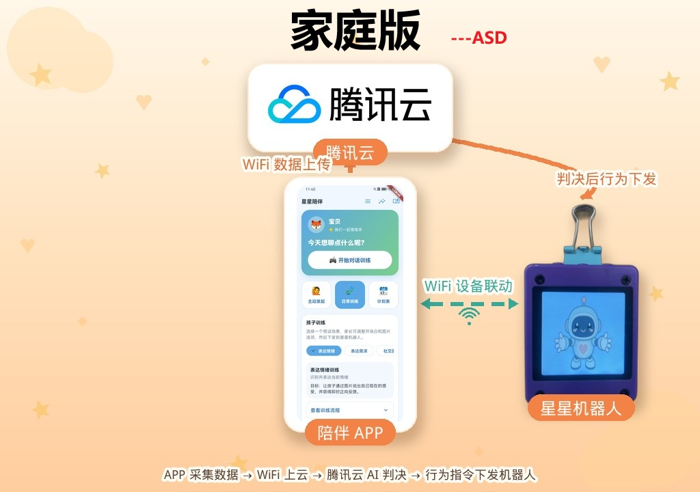

### 教师版
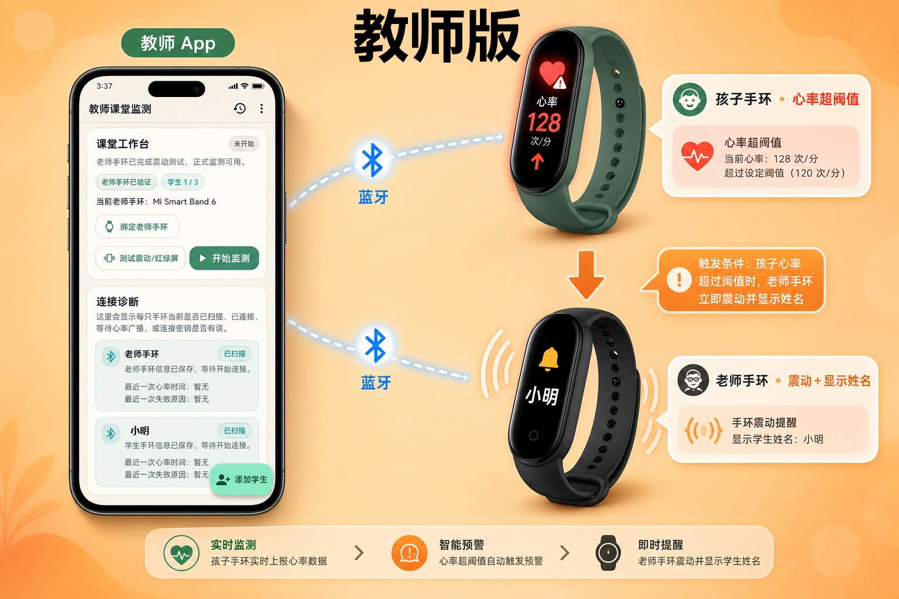

---

## 目录

- [1. 仓库结构](#1-仓库结构)
- [2. 模式一：家庭版-多动症](#2-模式一家庭版-多动症)
- [3. 模式二：家庭版-孤独症](#3-模式二家庭版-孤独症)
- [4. 模式三：教师版](#4-模式三教师版)
- [5. Flutter App 整体结构](#5-flutter-app-整体结构)
- [6. 云端服务（server/）](#6-云端服务server)
- [7. API 速查](#7-api-速查)
- [8. 部署指引](#8-部署指引)
- [9. 已知限制](#9-已知限制)

---

## 1. 仓库结构

```text
ADHD_Monitor/
├── lib/                        # Flutter App（三种模式共用入口）
│   ├── main.dart               # AppModeShell：启动时选择模式（家长/教师）
│   ├── screens/
│   │   ├── home_screen.dart    # 家庭版-多动症主界面
│   │   ├── autism_family_shell.dart  # 家庭版-孤独症主界面
│   │   ├── breathing_ball_page.dart  # 正念呼吸球页面
│   │   ├── esp_provision_page.dart   # BLE 配网页面
│   │   ├── footprint_page.dart       # 今日足迹 / AI 趋势
│   │   └── weekly_report_page.dart   # AI 周报
│   ├── teacher/
│   │   ├── teacher_shell.dart        # 教师版主界面
│   │   ├── teacher_ble_service.dart  # 多手环 BLE 管理
│   │   ├── teacher_models.dart       # 学生/报警数据模型
│   │   └── teacher_local_store.dart  # 本地持久化
│   └── services/               # MiBand / Cloud / ESP 配网 / 压力计算等
│
├── ESP32-S3-LCD-1.47B/         # 毛绒球呼吸灯固件（家庭版-多动症）
│
├── xiaozhi-esp32-2.2.4/        # 星星机器人固件（家庭版-多动症 语音陪伴 / 教师版通知）
│   └── main/
│       ├── adhd_remote_cmd.cc  # 长轮询接收 xiaozhi_invoke_chat 命令
│       ├── adhd_prov_ble.cc    # BLE 配网（与毛绒球同协议）
│       └── application.cc      # Bypass OTA，强制 WebSocket 语音协议
│
├── xingxing/                   # 星星机器人固件（家庭版-孤独症 图片交互）
│   └── main/
│       ├── action_cards.cc     # 图片卡片展示 + 摇晃/拍打交互
│       └── adhd_remote_cmd.cc  # 接收训练场景命令 + 下载图片
│
└── server/                     # 腾讯云 Flask 服务
    ├── app.py                  # 主程序：路由 / Kimi / 周报 / 长轮询 / 图片生成
    └── xiaozhi_bridge.py       # /xiaozhi/ws WebSocket 语音桥接
```

---

## 2. 模式一：家庭版-多动症

**场景**：孩子佩戴小米手环，家长手持手机。心率/压力异常时 App 报警，引导孩子正念呼吸（毛绒球呼吸灯联动），家长记录后星星机器人主动开口陪伴孩子。

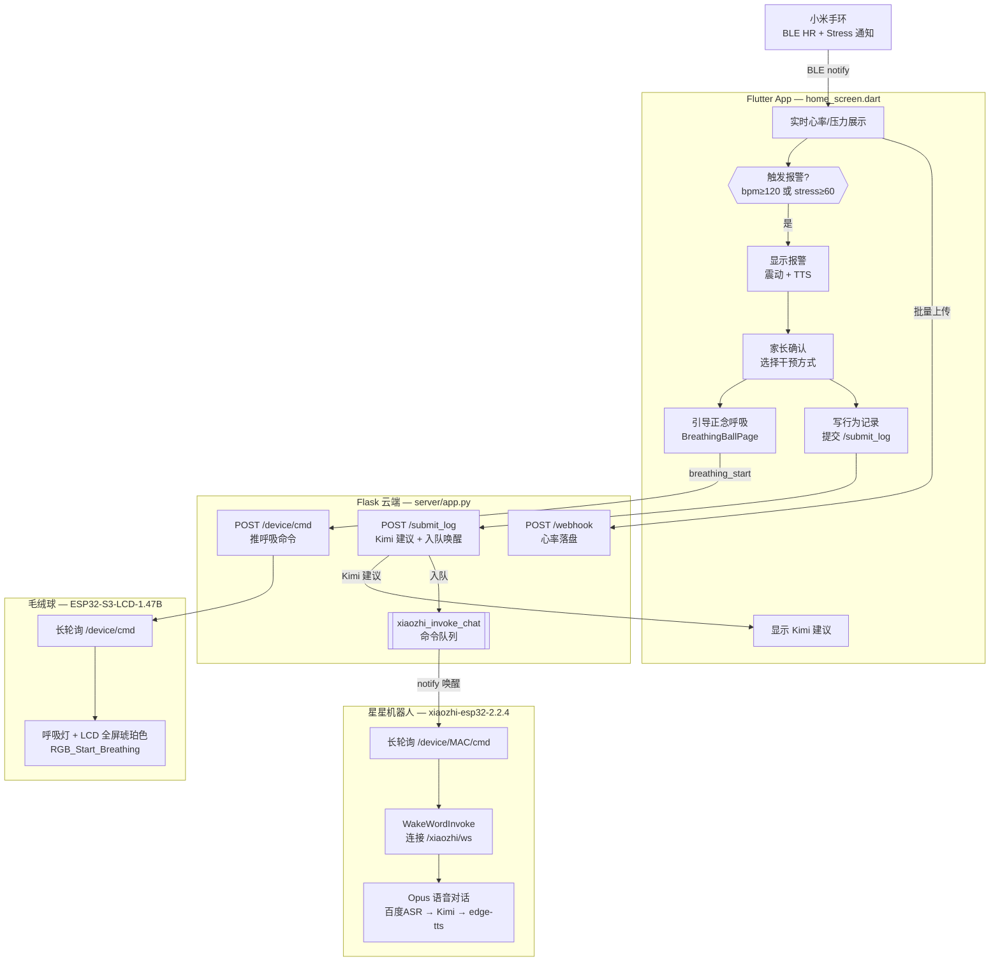

### 2.1 设备首次配网流程

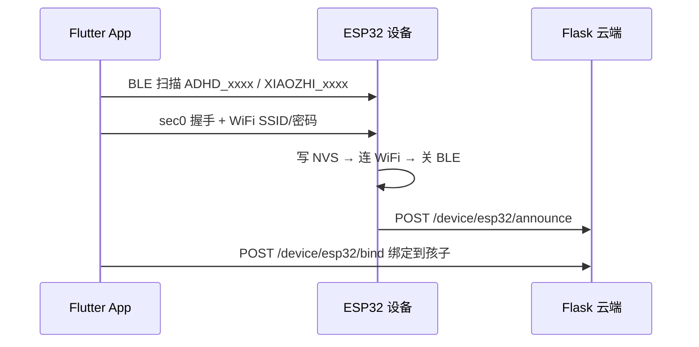

毛绒球广播名：ADHD_<MAC末4字节>；星星机器人广播名：XIAOZHI_<MAC8>。配网后 BLE 自动关闭，之后全部走云端中转。

### 2.2 心率报警去抖

- **bpm 通道**：每 3 s 拉 GET /webhook，lert=true 触发。
- **stress 通道**：手环私有特征，阈值默认 60（App 顶栏可调 30-90）。
- **抑制窗口**：报警确认后 45 s 内或服务器返回一次 lert=false 即解除，避免重复弹出。

### 2.3 呼吸 Watchdog

reathing_start 命令携带 	tl_ms（默认 10 分钟）。若手机离线导致 reathing_stop 永远到不了，毛绒球也会在超时后自动熄灯，防止一直亮着。

---

## 3. 模式二：家庭版-孤独症

**场景**：家长从 App 选择训练场景，云端生成选项图片并下发给 xingxing 设备，孩子通过**摇晃**切换选项、**拍打**确认，结果回传家长手机。

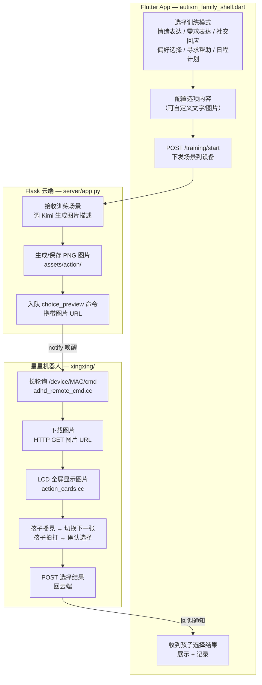

### 3.1 训练场景列表

| 场景 | 孩子操作 | 机器人行为 |
|------|---------|-----------|
| 情绪表达 | 摇晃切换开心/难过/生气/害怕，拍打确认 | 复述选择并表扬 |
| 需求表达 | 选择喝水/吃东西/上厕所/休息 | 告知家长，家长手机震动 |
| 社交回应 | 选择打招呼回应 | 继续追问，训练对话 |
| 偏好选择 | 从家长预设选项中选择 | 确认并鼓励执行 |
| 寻求帮助 | 选择"需要/不需要帮忙" | 告知家长 |

### 3.2 图片交互机制（xingxing 固件）

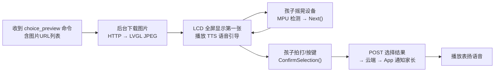

---

## 4. 模式三：教师版

**场景**：老师和最多 3 名学生各自佩戴小米手环，App 直接通过 BLE 同时连接全部手环，任一学生心率异常时 App 立即报警并标注学生姓名，老师手环同步震动提醒。

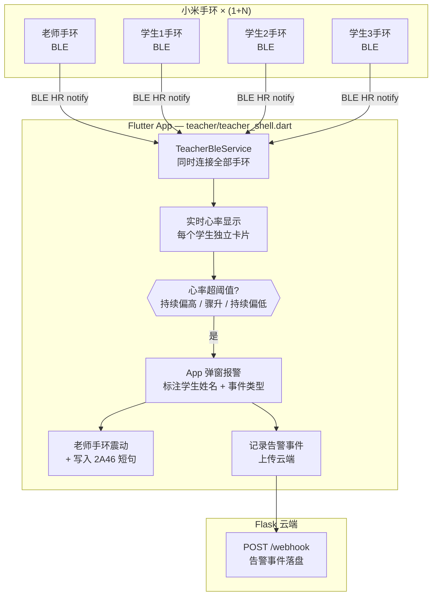

### 4.1 报警规则

| 规则 | 触发条件 |
|------|---------|
| 心率持续偏高 | 连续 N 次采样 ≥ 学生设定阈值（默认 120） |
| 心率持续偏低 | 连续 N 次采样 ≤ 低阈值（默认 70） |
| 心率短时骤升 | 5 分钟内较近期基线上升 ≥ 30% |

- 每个学生阈值可单独配置，并按年龄段给出参考正常范围。
- 同一学生报警后 90 秒内不重复弹出（冷却期）。
- 老师手环通过写 BLE GATT 特征 x2A46 发送包含学生姓名的振动短句。

---

## 5. Flutter App 整体结构

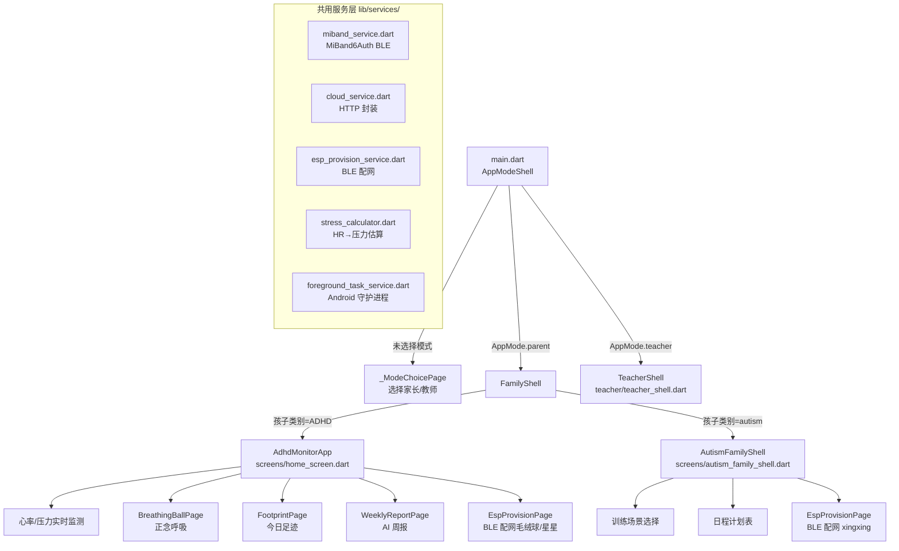

### 模式切换说明

启动时若无缓存模式记录则弹出选择页；家长模式下进入孩子档案页面后可根据孩子**疾病类别**自动路由到多动症或孤独症界面。切换模式需从顶栏菜单退出。

---

## 6. 云端服务（server/）

### 6.1 整体结构

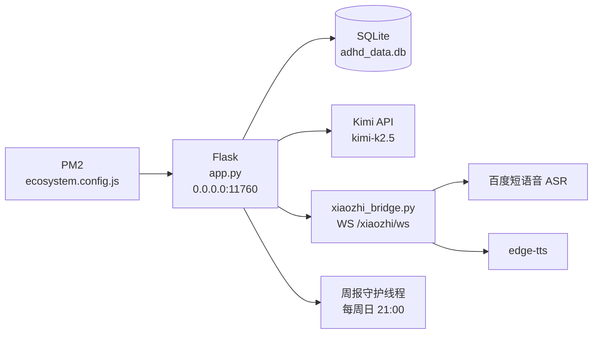

### 6.2 ESP32 长轮询命令通道

App 推命令 → 云端用 	hreading.Condition 立即唤醒正在 hold 的设备连接 → 设备收到后执行，延迟 < 100 ms。

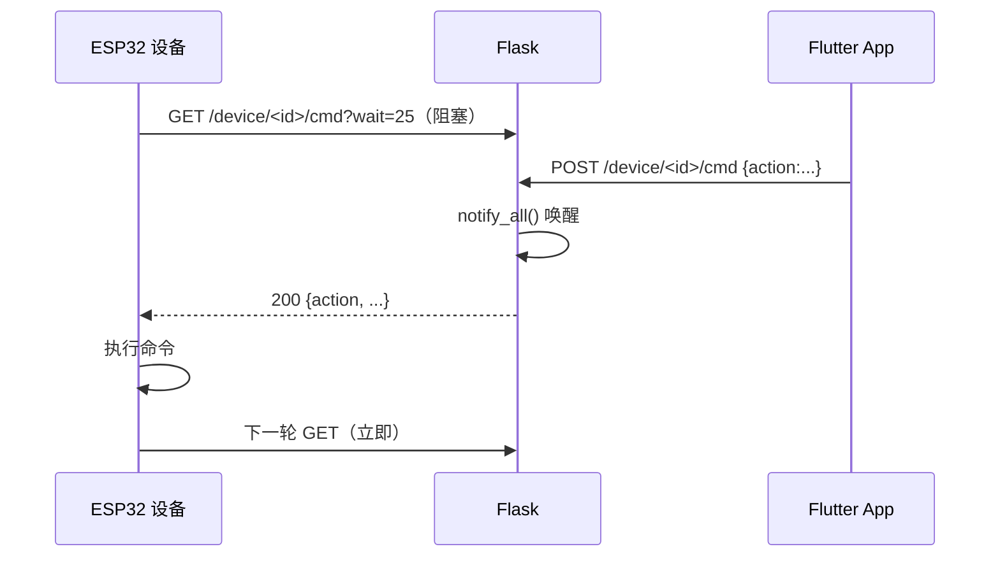

### 6.3 星星机器人语音通道（/xiaozhi/ws）

家长提交行为记录后，星星机器人被自动唤醒主动开口陪伴孩子：

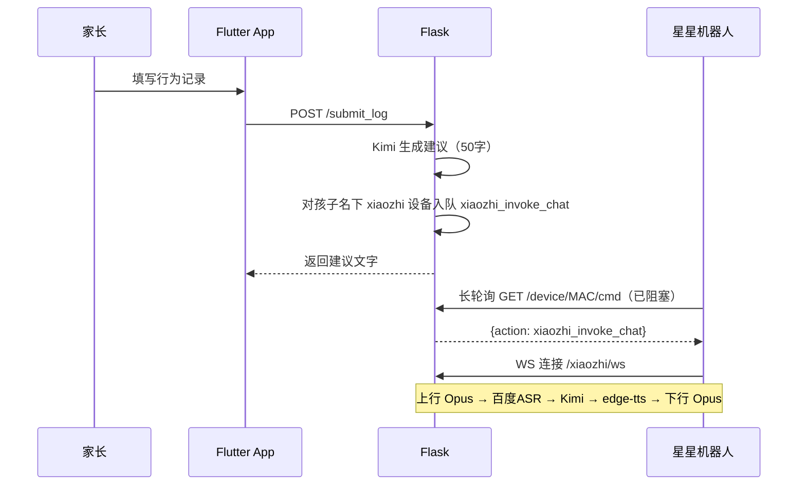

### 6.4 孤独症训练图片服务

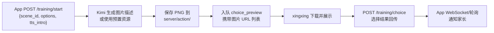

---

## 7. API 速查

| 方法 | 路径 | 说明 |
|------|------|------|
| POST | /auth/register / /auth/login | 注册 / 登录，返回 Bearer token |
| GET/POST | /webhook | 心率上传 / 查询最新状态 |
| POST | /submit_log | 写行为记录 + Kimi 建议 + 星星唤醒 |
| GET | /footprint/today | 今日记录 + 干预前后趋势 |
| GET | /weekly_report/latest | 最新 AI 周报 |
| POST | /training/start | 下发孤独症训练场景（图片+语音） |
| POST | /device/esp32/announce | 设备上电自报 |
| GET/POST | /device/<id>/cmd | 长轮询拉取 / 推送命令 |
| WS | /xiaozhi/ws | 星星机器人语音上下行（Opus） |
| GET | /my/children | 查看孩子列表 |
| POST | /device/esp32/bind | 绑定 ESP32 到孩子（kind 区分毛绒球/星星/xingxing） |

---

## 8. 部署指引

### 8.1 云端服务（server/）

`ash
cd server
python3 -m venv .venv && source .venv/bin/activate
pip install -r requirements.txt
cp .env.example ~/.config/adhd-monitor.env
# 编辑填入 MOONSHOT_API_KEY / BAIDU_SPEECH_API_KEY 等
pm2 startOrRestart ecosystem.config.js
```

主要环境变量：MOONSHOT_API_KEY（必填）、BAIDU_SPEECH_API_KEY / BAIDU_SPEECH_SECRET_KEY（星星语音必填）、XIAOZHI_WEBSOCKET_TOKEN（可选，WebSocket 鉴权）。

### 8.2 毛绒球固件（ESP32-S3-LCD-1.47B/）

```powershell
cd ESP32-S3-LCD-1.47B
.\idf.ps1 set-target esp32s3
.\idf.ps1 menuconfig   # 填写 ADHD Cloud host/port
.\idf.ps1 build
.\idf.ps1 -p COM4 flash monitor
```

### 8.3 星星机器人固件

**家庭版-多动症**（xiaozhi-esp32-2.2.4/）：

```powershell
cd xiaozhi-esp32-2.2.4
# menuconfig → ADHD Monitor integration:
#   启用 Long-poll /device/<mac>/cmd
#   填写 ADHD_MONITOR_CMD_HOST / PORT
#   填写 ADHD_MONITOR_WS_URL (ws://<host>:11760/xiaozhi/ws)
#   WiFi Config Method → ADHD Monitor BLE (network_provisioning, sec0)
.\build.bat
.\flash.bat
```

**家庭版-孤独症**（xingxing/）：

```powershell
cd xingxing
# menuconfig → 填写 ADHD Monitor host/port
.\build.bat
.\flash.bat
```

### 8.4 Flutter App（lib/）

`ash
flutter pub get
flutter run    # 需真机（BLE）
```

---

## 9. 已知限制

- 目前仅支持**小米手环 6**；教师版最多同时连接 3 名学生手环。
- 目前仅支持 **Android**；iOS 需要额外处理蓝牙后台权限。
- Android 不允许读取当前 WiFi 密码，BLE 配网时**必须手动输入**。
- 孤独症模式图片由 Kimi 文字描述后本地生成，复杂场景图质量依赖 prompt。
- AI 周报守护线程目前固定 child_id=1；多孩子家庭需手动 POST /weekly_report/generate。
- 家长吐槽内容无法自动推送小红书（小红书未开放创作接口）。
